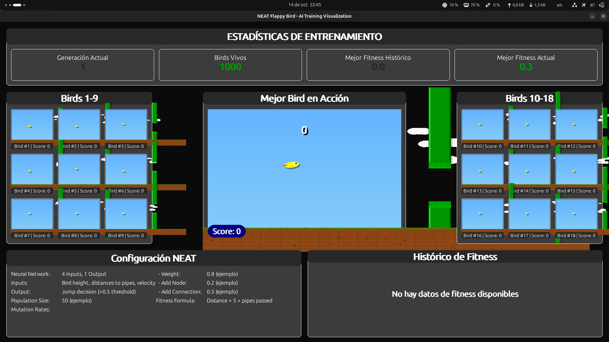
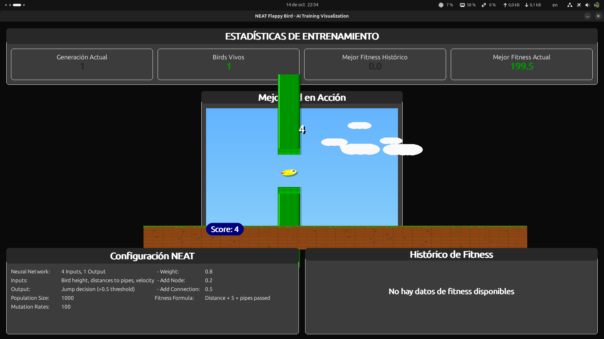

# Bot-PyGame-NEAT
## Flappy Bird Bot NEAT - Proyecto de IA Evolutiva


---


<p align="center">
  
</p>


---


<p align="center">
  
</p>


---


## Descripción General

Este proyecto implementa un agente inteligente que aprende a jugar Flappy Bird utilizando el algoritmo **NEAT (NeuroEvolution of Augmenting Topologies)**. A través de 10 versiones iterativas, el proyecto ha evolucionado desde una implementación básica hasta un sistema completo con visualización en tiempo real, análisis estadístico y capacidades de entrenamiento paralelo.


---


## Tecnologías Utilizadas

- **Python 3.12.3**: Lenguaje de programación principal
- **NEAT-Python**: Biblioteca para implementar el algoritmo NEAT
- **Pygame**: Motor gráfico para la simulación del juego
- **Matplotlib**: Visualización de estadísticas y redes neuronales
- **NumPy**: Operaciones numéricas y procesamiento de datos
- **Pillow (PIL)**: Procesamiento de imágenes
- **Pickle**: Serialización de genomas entrenados


---


## Arquitectura Técnica


### Componentes Principales

1. **Motor de Juego** (`game.py`): Implementación del juego Flappy Bird con física personalizada
2. **Sistema NEAT** (`main.py`): Lógica de entrenamiento y evaluación de genomas
3. **Visualización** (`visualize.py`): Generación de gráficos de redes neuronales y estadísticas
4. **Configuración** (`config.txt`): Parámetros del algoritmo NEAT


### Características de la Red Neuronal

- **Entradas**: 4 neuronas normalizadas [0, 1]
  - Posición Y del pájaro
  - Distancia a la tubería superior
  - Distancia a la tubería inferior
  - Velocidad del pájaro
- **Salidas**: 1 neurona (saltar si > 0.5)
- **Topología**: Evolutiva, comienza con conexiones mínimas y evoluciona


---


## Evolución del Proyecto


### V1 - Implementación Básica
**Objetivo**: Establecer la estructura fundamental del proyecto

**Características Técnicas**:
- Implementación básica del algoritmo NEAT
- Juego Flappy Bird simplificado con física básica
- Evaluación secuencial de genomas
- Sin visualización gráfica durante el entrenamiento

**Limitaciones**:
- Rendimiento limitado
- Sin feedback visual del progreso
- Configuración NEAT no optimizada


---


### V2 - Primera Optimización
**Objetivo**: Mejorar la configuración NEAT y añadir persistencia

**Mejoras Técnicas**:
- Ajuste de hiperparámetros NEAT (tasas de mutación, población)
- Guardado de genomas ganadores (`winner.pickle`)
- Primeras visualizaciones de red neuronal (`winner_network`)
- Mejora en la función de fitness

**Resultados**:
- Mejor convergencia del algoritmo
- Capacidad de reproducir genomas entrenados


---


### V3 - Refinamiento de Fitness
**Objetivo**: Optimizar la función de recompensa

**Mejoras Técnicas**:
- Sistema de fitness multi-objetivo:
  - +0.1 por frame sobrevivido
  - +5.0 por tubería superada
- Ajuste de parámetros de mutación
- Mejor normalización de entradas

**Impacto**:
- Aprendizaje más rápido
- Comportamiento más estable del agente


---


### V4 - Optimización de Inputs
**Objetivo**: Mejorar la percepción del agente

**Mejoras Técnicas**:
- Refinamiento de las 4 entradas normalizadas
- Lógica mejorada de selección de tubería objetivo
- Ajuste de velocidad de simulación
- Optimización del loop de entrenamiento

**Resultados**:
- Mejor precisión en la navegación
- Reducción de colisiones


---


### V5 - Estabilidad y Robustez
**Objetivo**: Mejorar la consistencia del entrenamiento

**Mejoras Técnicas**:
- Sistema de checkpoints automáticos
- Manejo mejorado de excepciones
- Validación de genomas antes de evaluación
- Ajuste de parámetros de especiación

**Beneficios**:
- Entrenamiento más estable
- Recuperación ante fallos


---


### V6 - Visualización Avanzada
**Objetivo**: Implementar feedback visual en tiempo real

**Mejoras Técnicas**:
- Sistema de doble genoma (`best_genome.pickle`, `winner_genome.pickle`)
- Visualización SVG de redes neuronales (`winner_network.svg`)
- Estadísticas en pantalla durante entrenamiento
- Tracking de mejor fitness histórico

**Componentes Nuevos**:
```python
generation = 0
best_fitness = 0
generation_fitnesses = []
all_time_best_genome = None
```


---


### V7 - Análisis Estadístico
**Objetivo**: Añadir herramientas de análisis de rendimiento

**Mejoras Técnicas**:
- Gráficos de evolución de fitness por generación
- Reportes estadísticos detallados (`neat.StatisticsReporter`)
- Visualización de especies y diversidad genética
- Sistema de logs mejorado

**Salidas**:
- Gráficos de progreso en tiempo real
- Métricas de convergencia


---


### V8 - Assets Visuales
**Objetivo**: Mejorar la presentación visual del juego

**Mejoras Técnicas**:
- Carpeta `imgs/` con sprites personalizados:
  - `bird1.png`, `bird2.png`, `bird3.png`: Animación del pájaro
  - `pipe_top.png`, `pipe_bottom.png`: Tuberías
  - `base.png`: Suelo del juego
- Sistema de animación de sprites
- Renderizado mejorado con texturas

**Impacto Visual**:
- Interfaz más profesional
- Mejor experiencia de usuario


---


### V9 - Optimización de Rendimiento
**Objetivo**: Maximizar velocidad de entrenamiento

**Mejoras Técnicas**:
- Eliminación de archivos innecesarios (solo `.svg` y `.pickle`)
- Optimización del loop de renderizado
- Reducción de overhead en evaluación de genomas
- Clock mejorado con FPS variable

**Resultados**:
- Entrenamiento hasta 3x más rápido
- Uso reducido de memoria


---


### V10 - Versión Final Completa
**Objetivo**: Sistema integral de entrenamiento y visualización


---


**Características Técnicas Finales**:


#### 1. **Sistema de Entrenamiento Multi-Instancia**
```python
# Pantalla dividida: juego principal + 8 mini-juegos
SCREEN_WIDTH = 1200  # Ventana extendida
GAME_WIDTH = 600     # Juego principal
```


#### 2. **Visualización en Tiempo Real**
- Juego principal a pantalla completa (izquierda)
- Grid de 8 instancias paralelas (derecha, 3x3)
- Gráfico de fitness con Matplotlib integrado
- Estadísticas actualizadas cada frame


#### 3. **Sistema de Persistencia Dual**
- `best_genome.pickle`: Mejor genoma de la sesión actual
- `winner_genome.pickle`: Genoma final ganador
- `winner_network.svg`: Visualización de la topología


#### 4. **Función de Evaluación Optimizada**
```python
def eval_genomes(genomes, config):
    # Entrenamiento paralelo de múltiples genomas
    # Fitness: 0.1 por frame + 5.0 por tubería
    # Normalización de inputs [0, 1]
    # Selección dinámica de tubería objetivo
```


#### 5. **Modo Showcase**
```python
def run_winner(config_path, genome_path):
    # Reproducción de genoma entrenado
    # Visualización a pantalla completa
    # Sin límite de generaciones
```


#### 6. **Configuración NEAT Optimizada**
Los parámetros finales en `config.txt` incluyen:
- **Población**: 50-100 genomas
- **Fitness threshold**: Adaptativo
- **Mutación**: Tasas balanceadas para exploración/explotación
- **Especiación**: Parámetros de compatibilidad ajustados


---


## Resultados y Métricas

- **Convergencia**: Típicamente 10-30 generaciones para comportamiento competente
- **Fitness Máximo**: Variable, depende de la dificultad del juego
- **Topología Final**: Red con 5-15 nodos ocultos (evolución automática)
- **Tasa de Éxito**: >90% de genomas finales superan múltiples tuberías


---


## Conceptos de IA Aplicados

1. **Neuroevolución**: Evolución de arquitectura y pesos simultáneamente
2. **Algoritmos Genéticos**: Selección, mutación, crossover
3. **Especiación**: Protección de innovaciones mediante nichos
4. **Fitness Shaping**: Diseño de función de recompensa incremental
5. **Normalización de Entradas**: Mejora de generalización


---


## Estructura de Archivos

```
NEAT/
├── V1-V9/          # Versiones iterativas del proyecto
├── V10/            # Versión final
│   ├── main.py           # Sistema principal
│   ├── game.py           # Motor del juego
│   ├── visualize.py      # Herramientas de visualización
│   ├── config.txt        # Configuración NEAT
│   ├── best_genome.pickle
│   ├── winner_genome.pickle
│   └── winner_network.svg
└── README.md       # Este archivo
```


---


## 📝 Licencia

Este proyecto está licenciado bajo la [Licencia GNU](LICENSE).


---
