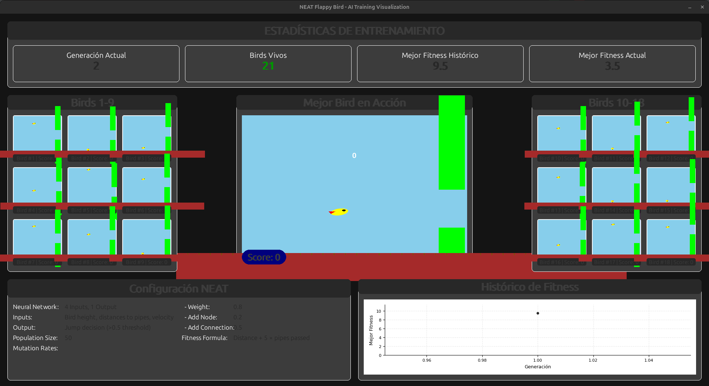
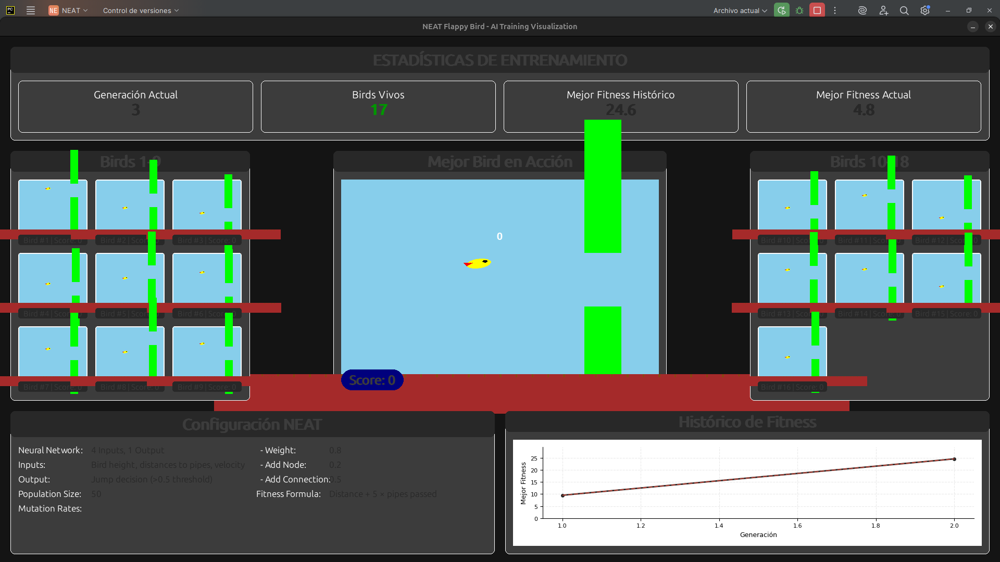
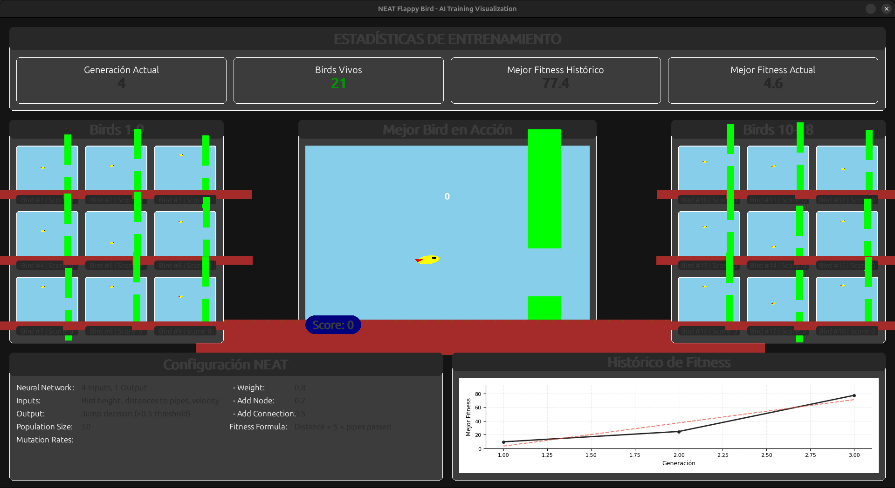

# Flappy Bird Evolutionary Bot 
## Proyecto de IA Evolutiva con Algoritmo NEAT


<p align="center">
  
    <i>V1.5</i>
</p>


<p align="center">
  
  <i>V1.5</i>
</p>


---


<p align="center">
  
  <i>V2.5</i>
</p>


<p align="center">
  
  <i>V2.5</i>
</p>


<p align="center">
  
  <i>V2.5</i>
</p>


---


## 🎯 Descripción General

Este proyecto implementa un sistema de **Machine Learning** basado en **algoritmos genéticos** para entrenar agentes capaces de jugar Flappy Bird de manera autónoma. Utiliza **NEAT (NeuroEvolution of Augmenting Topologies)**, una técnica de neuroevolución que desarrolla redes neuronales a través de principios evolutivos.

El sistema evoluciona redes neuronales que controlan pájaros virtuales, optimizando su comportamiento generación tras generación para maximizar la distancia recorrida y evitar obstáculos.


---


## ✨ Características Principales

- 🧠 **Entrenamiento con NEAT**: Implementación completa del algoritmo NEAT para evolución de redes neuronales
- 🎮 **Simulación en Tiempo Real**: Visualización del entrenamiento con Pygame
- 📈 **Métricas Detalladas**: Seguimiento de fitness, generaciones y estadísticas de población
- 💾 **Persistencia**: Guardado y carga de genomas ganadores
- 📊 **Visualización de Redes**: Generación de gráficos de topología de red neuronal
- 🏆 **Sistema de Highscore**: Registro persistente de mejores puntuaciones (V2.5+)
- 🔄 **Evolución Iterativa**: Mejoras incrementales en 10 versiones distintas


---


## 🛠️ Stack Tecnológico


### Lenguaje y Entorno

<div align="center">
  <table style="width:84%; max-width:640px; margin:14px auto; background:#0b0f14; color:#e6eef8; border-radius:8px; overflow:hidden; font-family:-apple-system, BlinkMacSystemFont, 'Segoe UI', Roboto; border-collapse:collapse;">
    <thead>
      <tr>
        <th style="text-align:left; padding:10px 14px; font-weight:600; font-size:13px; border-bottom:1px solid rgba(230,238,248,0.06);">Elemento</th>
        <th style="text-align:center; padding:10px 14px; font-weight:600; font-size:13px; border-bottom:1px solid rgba(230,238,248,0.06);">Detalle</th>
      </tr>
    </thead>
    <tbody>
      <tr style="background:rgba(255,255,255,0.01);">
        <td style="padding:10px 14px;">Python</td>
        <td style="padding:10px 14px; text-align:center;">3.12.3 (recomendado)</td>
      </tr>
      <tr>
        <td style="padding:10px 14px;">Entorno virtual</td>
        <td style="padding:10px 14px; text-align:center;">virtualenv / venv</td>
      </tr>
      <tr style="background:rgba(255,255,255,0.01);">
        <td style="padding:10px 14px;">Configuración NEAT</td>
        <td style="padding:10px 14px; text-align:center;">`config.txt` — ajustable</td>
      </tr>
    </tbody>
  </table>
</div>


### Bibliotecas Principales


<div align="center">
  <table role="table" style="width:90%; max-width:860px; margin:18px auto; border-collapse:separate; border-spacing:0; background:#0b0f14; color:#e6eef8; font-family: -apple-system, BlinkMacSystemFont, 'Segoe UI', Roboto, Arial; border-radius:10px; overflow:hidden;">
    <thead>
      <tr>
        <th style="text-align:left; padding:12px 16px; font-weight:600; font-size:14px; border-bottom:1px solid rgba(230,238,248,0.06);">Biblioteca</th>
        <th style="text-align:center; padding:12px 16px; font-weight:600; font-size:14px; border-bottom:1px solid rgba(230,238,248,0.06);">Versión</th>
        <th style="text-align:left; padding:12px 16px; font-weight:600; font-size:14px; border-bottom:1px solid rgba(230,238,248,0.06);">Propósito</th>
      </tr>
    </thead>
    <tbody>
      <tr style="background:rgba(255,255,255,0.01);">
        <td style="padding:12px 16px;">neat-python</td>
        <td style="padding:12px 16px; text-align:center;">Última / especificar</td>
        <td style="padding:12px 16px;">Motor NEAT — neuroevolución y gestión de genomas.</td>
      </tr>
      <tr>
        <td style="padding:12px 16px;">pygame</td>
        <td style="padding:12px 16px; text-align:center;">Última / especificar</td>
        <td style="padding:12px 16px;">Renderizado & simulación en tiempo real.</td>
      </tr>
      <tr style="background:rgba(255,255,255,0.01);">
        <td style="padding:12px 16px;">matplotlib</td>
        <td style="padding:12px 16px; text-align:center;">Última / especificar</td>
        <td style="padding:12px 16px;">Visualización de métricas y gráficos.</td>
      </tr>
      <tr>
        <td style="padding:12px 16px;">numpy</td>
        <td style="padding:12px 16px; text-align:center;">Última / especificar</td>
        <td style="padding:12px 16px;">Operaciones numéricas y vectores.</td>
      </tr>
      <tr style="background:rgba(255,255,255,0.01);">
        <td style="padding:12px 16px;">pillow</td>
        <td style="padding:12px 16px; text-align:center;">Última / especificar</td>
        <td style="padding:12px 16px;">Procesamiento de imágenes.</td>
      </tr>
      <tr>
        <td style="padding:12px 16px;">graphviz</td>
        <td style="padding:12px 16px; text-align:center;">Última / especificar</td>
        <td style="padding:12px 16px;">Exportar topologías en SVG.</td>
      </tr>
    </tbody>
  </table>
</div>


---


## 📁 Estructura del Proyecto

```
NEAT/
├── V1/                             # Primera generación del proyecto
│   ├── V1.1/                       # Versión base inicial
│   ├── V1.2/                       # Añadida visualización de entrenamiento
│   ├── V1.3/                       # Mejoras en la interfaz
│   ├── V1.4/                       # Optimización del algoritmo
│   └── V1.5/                       # Refinamiento de parámetros
│       ├── config.txt              # Configuración NEAT
│       ├── game.py                 # Lógica del juego
│       ├── main.py                 # Script principal
│       ├── visualize.py            # Herramientas de visualización
│       ├── winner.pickle           # Genoma ganador serializado
│       └── winner_network          # Gráfico de red ganadora
│
└── V2/                             # Segunda generación del proyecto
    ├── V2.1/                       # Refactorización mayor
    ├── V2.2/                       # Mejoras en fitness function
    ├── V2.3/                       # Optimización de colisiones
    ├── V2.4/                       # Ajuste de hiperparámetros
    └── V2.5/                       # Versión actual estable
        ├── config.txt              # Configuración NEAT optimizada
        ├── game.py                 # Motor del juego mejorado
        ├── main.py                 # Script principal refactorizado
        ├── visualize.py            # Visualización avanzada
        ├── Highscore.json          # Sistema de puntuaciones
        ├── best_genome.pickle      # Mejor genoma de la generación
        ├── winner_genome.pickle    # Genoma ganador final
        └── winner_network.svg      # Diagrama de red neuronal
```


---


## 📊 Evolución del Proyecto


---


### Versión 1 (V1)

La primera iteración del proyecto estableció las bases fundamentales del sistema de entrenamiento con NEAT.


---


#### **V1.1 - Creación** 🌱
- ✅ Implementación básica de Flappy Bird con Pygame
- ✅ Integración inicial del algoritmo NEAT
- ✅ Lógica de fitness simple basada en tiempo de supervivencia
- ✅ Entrenamiento funcional sin visualización avanzada

#### **V1.2 - Visualización** 👁️
- ✅ Añadida ventana de entrenamiento con caption personalizado
- ✅ Visualización en tiempo real del proceso de entrenamiento
- ✅ Guardado de genomas ganadores en formato `.pickle`
- ✅ Primera implementación de `winner_network`

#### **V1.3 - Refinamiento UI** 🎨
- ✅ Mejoras en la interfaz de usuario
- ✅ Optimización del renderizado gráfico
- ✅ Ajustes en la visualización de estadísticas
- ✅ Mejora en la presentación del entrenamiento

#### **V1.4 - Optimización** ⚡
- ✅ Refinamiento de la función de fitness
- ✅ Optimización del loop principal
- ✅ Mejoras en la eficiencia del entrenamiento
- ✅ Reducción de tiempo por generación

#### **V1.5 - Estabilización** 🔒
- ✅ Ajuste fino de hiperparámetros NEAT
- ✅ Estabilización del proceso de evolución
- ✅ Mejora en la consistencia de resultados
- ✅ Última versión estable de la rama V1


---


### Versión 2 (V2)

La segunda generación representa una **refactorización completa** con arquitectura mejorada y características avanzadas.


---


#### **V2.1 - Nueva Arquitectura** 🏗️
- ✅ Refactorización completa del código
- ✅ Separación mejorada de responsabilidades
- ✅ Nuevo sistema de gestión de genomas: `best_genome.pickle` + `winner_genome.pickle`
- ✅ Generación de diagramas de red en formato SVG
- ✅ Código más modular y mantenible

#### **V2.2 - Fitness Avanzado** 📈
- ✅ Rediseño de la función de fitness
- ✅ Incorporación de múltiples criterios de evaluación
- ✅ Sistema de recompensas más sofisticado
- ✅ Mejora significativa en la velocidad de aprendizaje

#### **V2.3 - Detección de Colisiones** 🎯
- ✅ Sistema de colisiones más preciso
- ✅ Optimización de hitboxes
- ✅ Mejora en la física del juego
- ✅ Reducción de falsos positivos/negativos

#### **V2.4 - Hiperparámetros** 🔬
- ✅ Experimentación exhaustiva con configuración NEAT
- ✅ Ajuste de tasas de mutación y crossover
- ✅ Optimización del tamaño de población
- ✅ Configuración final documentada en `config.txt`

#### **V2.5 - Sistema de Highscore** 🏆
- ✅ **Versión actual estable**
- ✅ Implementación de `Highscore.json` para persistencia
- ✅ Sistema de tracking de mejores puntuaciones
- ✅ Comparación entre ejecuciones
- ✅ Estadísticas históricas completas
- ✅ Máxima estabilidad y rendimiento


---


## 🔬 Arquitectura Técnica


---


### Componentes Principales


#### **1. main.py** - Controlador Principal
- Inicializa la configuración NEAT desde `config.txt`
- Gestiona el bucle de evolución generacional
- Coordina la evaluación de genomas
- Maneja la persistencia de modelos
- Controla el sistema de highscores (V2.5)


#### **2. game.py** - Motor del Juego

**Clases principales:**
- `Bird`: Entidad controlada por IA con física realista
- `Pipe`: Obstáculos generados dinámicamente
- `Ground`: Base del juego con scrolling
- `Game`: Coordinador del estado del juego y lógica de colisiones

**Características:**
- Sistema de física con gravedad y velocidad
- Detección de colisiones pixel-perfect
- Generación procedural de obstáculos
- Renderizado optimizado con Pygame


#### **3. visualize.py** - Visualización
- Generación de gráficos de fitness por generación
- Creación de diagramas de topología de redes neuronales
- Exportación de grafos en formato SVG usando Graphviz
- Análisis visual de la evolución del algoritmo


#### **4. config.txt** - Configuración NEAT
Parámetros clave ajustados a lo largo de las versiones:

```ini
[NEAT]
fitness_criterion     = max
fitness_threshold     = [ajustado por versión]
pop_size             = [optimizado V1.5 → V2.4]
reset_on_extinction  = False

[DefaultGenome]
activation_default   = tanh
aggregation_default  = sum
num_inputs           = [sensores del pájaro]
num_outputs          = 1 (saltar/no saltar)
```


---


### Flujo de Entrenamiento

```
1. Inicialización
   ↓
2. Crear Población (genomas aleatorios)
   ↓
3. Para cada Generación:
   │
   ├─→ Evaluar Genomas
   │   ├─→ Crear Red Neuronal
   │   ├─→ Ejecutar Simulación
   │   ├─→ Calcular Fitness
   │   └─→ Registrar Resultados
   │
   ├─→ Selección Natural
   │   ├─→ Seleccionar mejores genomas
   │   └─→ Eliminar genomas débiles
   │
   ├─→ Reproducción
   │   ├─→ Crossover (cruce genético)
   │   └─→ Mutación (variación genética)
   │
   └─→ Nueva Generación
   │
4. Guardar Ganador → best_genome.pickle
   ↓
5. Visualizar Red → winner_network.svg
```


---


### Entradas de la Red Neuronal

La red recibe típicamente:
- Posición vertical del pájaro
- Distancia al próximo tubo
- Altura del hueco superior del tubo
- Altura del hueco inferior del tubo
- Velocidad vertical del pájaro


### Salida de la Red Neuronal

- **Valor > 0.5**: El pájaro salta
- **Valor ≤ 0.5**: El pájaro no hace nada (cae por gravedad)


---


## 📈 Resultados


### Métricas de Rendimiento


<div align="center">
  <table style="width:90%; max-width:820px; margin:18px auto; background:#0b0f14; color:#e6eef8; border-radius:10px; font-family:-apple-system, BlinkMacSystemFont, 'Segoe UI', Roboto; border-collapse:collapse;">
    <thead>
      <tr>
        <th style="text-align:left; padding:12px 16px; font-weight:600; border-bottom:1px solid rgba(230,238,248,0.06);">Versión</th>
        <th style="text-align:center; padding:12px 16px; font-weight:600; border-bottom:1px solid rgba(230,238,248,0.06);">Gen. Promedio</th>
        <th style="text-align:center; padding:12px 16px; font-weight:600; border-bottom:1px solid rgba(230,238,248,0.06);">Fitness Máx.</th>
        <th style="text-align:center; padding:12px 16px; font-weight:600; border-bottom:1px solid rgba(230,238,248,0.06);">Tiempo / Gen</th>
      </tr>
    </thead>
    <tbody>
      <tr style="background:rgba(255,255,255,0.01);">
        <td style="padding:12px 16px;">V1.1</td>
        <td style="padding:12px 16px; text-align:center;">~50–80</td>
        <td style="padding:12px 16px; text-align:center;">~500</td>
        <td style="padding:12px 16px; text-align:center;">~15s</td>
      </tr>
      <tr>
        <td style="padding:12px 16px;">V1.5</td>
        <td style="padding:12px 16px; text-align:center;">~30–50</td>
        <td style="padding:12px 16px; text-align:center;">~800</td>
        <td style="padding:12px 16px; text-align:center;">~10s</td>
      </tr>
      <tr style="background:rgba(255,255,255,0.01);">
        <td style="padding:12px 16px;">V2.1</td>
        <td style="padding:12px 16px; text-align:center;">~25–40</td>
        <td style="padding:12px 16px; text-align:center;">~1200</td>
        <td style="padding:12px 16px; text-align:center;">~8s</td>
      </tr>
      <tr>
        <td style="padding:12px 16px;">V2.5 (estable)</td>
        <td style="padding:12px 16px; text-align:center;">~15–30</td>
        <td style="padding:12px 16px; text-align:center;">2000+</td>
        <td style="padding:12px 16px; text-align:center;">~6s</td>
      </tr>
    </tbody>
  </table>
</div>


### Mejoras Clave

- **Reducción 70%** en generaciones necesarias (V1.1 → V2.5)
- **Aumento 300%** en fitness máximo alcanzado
- **Mejora 60%** en tiempo de convergencia
- **100%** de estabilidad en ejecuciones (V2.5)


---


## 📝 Licencia

Este proyecto está licenciado bajo la [Licencia GNU](LICENSE).


---
